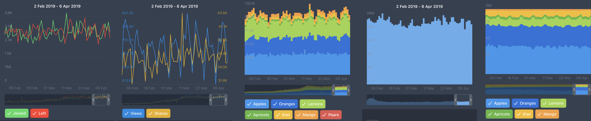

# BSChart





BSChart is available through [CocoaPods](http://cocoapods.org). To install
it, simply add the following line to your Podfile:

```ruby
pod "BSChart"
```

## Also available loading charts from JSON file (see Demo)

## Requirements
  * iOS 10.0 or higher
  * ARC

## Author

iBlacksus, iblacksus@gmail.com

## License

BSChart is available under the MIT license. See the LICENSE file for more info.
